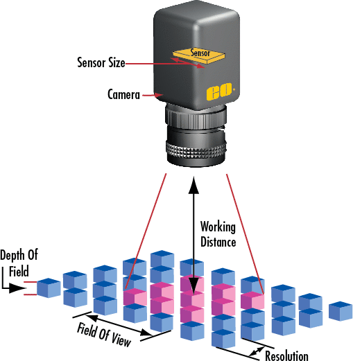

R"(
# Working distance



The working distance is the distance between lens of the camera and the object. 
An optimal working distance can be calculated using the Field of View (FOV) of the camera, the physical sensor size and the focal length of the lens.

To calculate the working distance the following base formula is used:

```
Focal length * FOV = Sensor size * Working distance

```

To get the working distance, transform the formula into:

```
Working distance = Focal length * FOV / Sensor size 

```

with FOV / Sensor size being the magnification.

Since the FOV is determined by the distance of the camera to the object, focal length and sensor size, 
the calculator will always do four calculations using the objects width and height to determine the optimal working distance.

```
dist1 = Focal length * Object length / Camera sensor width;
dist2 = Focal length * Object width  / Camera sensor height;

dist3 = Focal length * Object width  / Camera sensor width;
dist4 = Focal length * Object length / Camera sensor height;

dist12 = max(dist1, dist2);
dist34 = max(dist3, dist4);

Working distance = min(dist12, dist34) + depth of field;

```

Assume that the calculated working distance is corresponded to the shortest dimension of the object lying parallel to the shortest dimension of the camera sensor.
)"